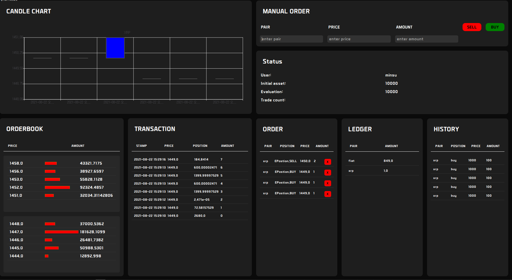
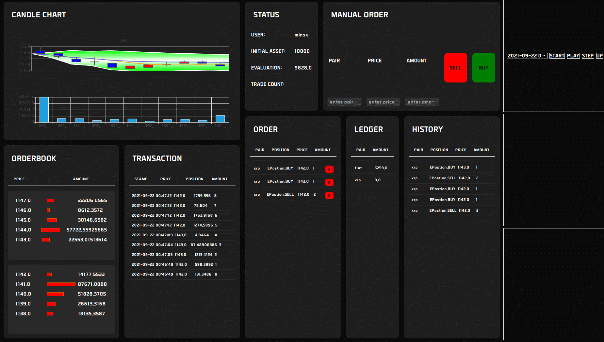

# Trader
* Semi-auto Algorithm trader.

## About
* bot-trader 는 order 데이터를 기반으로 market 을 simulation 하는 백테스팅 모듈과 매매전략을 적용하여 매매를 수행하는 프로그램.
* 수동 매매, 자동 매매 모듈 통합.

## Modules
* Data Collector
* Market Simulator
* Trading Strategy

## Library
* pyqt
* mongo

## In Progress

